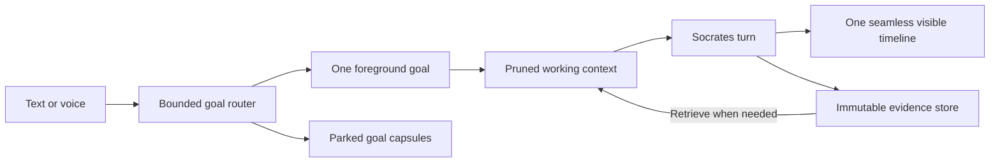

# Socrates V2 Flow Architecture

This document records the current implemented architecture, migration constraints, and technical mechanics of the experimental Socrates V2 Seamless Flow experience. `FLOW_NORTH_STAR.md` is the product-intent authority and `UNIFIED_SOCRATES_LIFECYCLE.md` is the detailed lifecycle/cleanup authority. Phase 1 removed the post-turn Memory Router, mutable main-agent goal ledger, and pending finalization fallback. Phase 3 converged Classic and Flow on typed parallel candidate retrieval, a no-tool semantic decision by the selected main Socrates, deterministic exact-memory selection, and one exact view-neutral context contract. The locked follow-up adds process-over-ceremony durable-state steering, release-only turn-local large-result control, automatic oldest-head compaction, exact-context Frontier transfer, and shared atomic finalization while removing the superseded context-policy authority. Namespaced physical runtime tables remain migration adapters rather than separate semantic state.

Status: the isolated first product cut is implemented behind the V2 boundary. Whole-workspace regression, production builds, normal runtime packaging, and a real browser E2E have passed. Formal accessibility automation, cross-platform release archives, full local speech-pack runs, and extended reliability validation remain; implementation does not mean that a 24-hour unattended soak has already passed.

The convergence architecture is fixed by `FLOW_NORTH_STAR.md`: one canonical Socrates work state behind Classic and Flow; Goals containing Tasks; completion separated from view selection; Projects → Goals → Queries navigation; one runtime-authored live activity sentence beneath the prominent orb; the validated answer replacing that live state while the orb recedes; and the Phase 1 public `AgentRuntime` beneath `SocratesAgent` and every bounded worker. `FLOW_CONVERGENCE_PHASE_0.md` through `FLOW_CONVERGENCE_PHASE_4.md` and the versioned Flow-convergence fixture record the migration evidence. The former flat-query and frontend-derived activity presentation debt is resolved.

## Absolute V1 And V2 Boundary

The boundary is non-negotiable until the user explicitly changes it.

### V1 Classic

V1 means the current project chat product and its current behavior:

- The existing chat window and project/conversation routes.
- The current `conversations`, `sessions`, `turns`, and `messages` model.
- The current Classic conversation persistence, agent-task/tool/Terminal audit rows, voice-input/read-aloud records, and title behavior.
- Existing HTTP, WebSocket, persistence, replay, and frontend contracts.

Classic and Flow now share the same semantic pre-turn lifecycle, but Classic must not write V2-only runtime rows merely to obtain that behavior. Existing V1 conversations must not be migrated, reinterpreted, or silently copied into V2 state. Classic may project a canonical goal/task association through the shared lifecycle while retaining its own conversation/session persistence. The explicitly approved shared composer microphone is also bounded: Classic may transcribe temporary conversation audio into its unsent draft, but that path creates no V2 speech artifact, job, event, or Flow state.

### V2 Flow

V2 is a separate experimental product surface and execution path:

- A separate V2 window or mode in the UI.
- One persistent visible Flow per project.
- Backend-managed goals inside that Flow.
- One foreground goal at execution time and compact parked goal capsules.
- A goal-aware exact model context with release-only large-result pruning and immutable evidence.
- Text and voice as equivalent ways to enter the same Flow.
- V2-namespaced contracts, persistence, events, services, and tests.
- A source-server feature flag that is off unless `SOCRATES_V2_FLOW_ENABLED=true`, plus an ordinary packaged NPM/runtime launcher that defaults the flag to `true` for the normal product.

`GET /api/v2/capabilities` remains mounted so the UI can report availability. When V2 is off, the Flow/speech HTTP routes and `/v2/ws` are not mounted; Classic remains available and continues to use the shared goal lifecycle through its own transport. Direct source-server development must set `SOCRATES_V2_FLOW_ENABLED=true`; the ordinary `scripts/runtime/launcher.mjs` passes the explicit environment value or defaults it to `true`, so the normal packaged web/backend product exposes the project-scoped **Go to Flow View** action. Classic's separate conversation-scoped STT route is intentionally available independently of that feature flag and creates no V2 speech state.

### Allowed Shared Foundation

V2 may reuse stable low-level infrastructure:

- Provider adapters and model catalog resolution.
- Hosted model and Ollama chat support.
- Embedding providers, LanceDB indexing, and retrieval algorithms.
- Workspace tools, file handling, artifacts, approvals, and Terminal execution.
- Agent runner primitives, structured-output validation, usage accounting, and error normalization.
- The same Socrates agent behavior and model-visible tool set.
- Workspace `.socrates/` project memory, notes, repo docs, resources, attachments, and project skills.
- Global `~/.Socrates/` identity, user profile, tool docs, provider credentials/settings, global skills, and MCP configuration.
- The same typed goal-card and memory-candidate retrieval adapters, deterministic exact-memory selector, and background Global Memory Agent.
- The accepted V2 Voice V1 speech engines: local Whisper, the three-model OpenRouter transcription allowlist, and local Kokoro-82M.

The rule is:

```text
reuse one semantic lifecycle and shared plumbing
keep presentation and persistence adapters explicit
```

Classic and Flow must enter the same semantic lifecycle. Their thin coordinators may translate between storage identities, but neither may own an alternative goal-decision, memory-selection, or context-assembly policy.

The older `V2 Provider Plan` wording in `PROVIDER_USAGE.md` referred to a later provider-adapter roadmap. It is not the V2 Flow product. Provider documentation must use unambiguous wording so the two ideas cannot be confused.

### Implemented Inheritance Map

The user-facing phrase "V2 inherits V1" means capability inheritance, not Classic conversation-state inheritance.

```text
shared by Classic and Seamless
  SocratesAgent and operating prompt
  provider/model catalog, credentials, Ollama, embeddings
  workspace tools and mutation locks
  approvals and Terminal supervisor primitives
  MCP registry and dynamic tools
  project/global skills, including Agent Skill ZIP import
  .socrates memory, notes, repo docs, resources, attachments
  ~/.Socrates identity, user profile, tool docs, settings
  typed parallel goal/memory candidate retrieval and Global Memory Agent
  same-Socrates goal resolution and deterministic exact-memory selection
  one exact resolved-turn context contract

owned only by Seamless
  persistent Flow and goals
  goal-message links and V2 lifecycle persistence effects
  deterministic goal titles and versioned capsules
  goal-aware context projection and evidence dispositions around shared Socrates
  v2.* contracts/events and /api/v2/* plus /v2/ws
  v2_* turns, tools, approvals, Terminals, evidence, usage, speech, recovery
```

V2 passes Flow/turn ids into shared runner primitives only as scoped runtime handles. Ordinary V2 execution never creates Classic model-call, tool-call, approval, evidence, usage, or event rows. **Open in Classic** may lazily create one Classic conversation/session home, but that home contains canonical task references rather than copied messages. Shared memory notes carry `sourceRuntime: "v2_flow"` and exact Flow/turn/message coordinates, and background memory processing must not append a Classic event for that source.

The Global Memory Agent is one application-level learner across both experiences. Its manifest includes unprocessed completed V2 turns with project/Flow/goal labels, it resolves their Q&A and raw evidence through the shared retrieval facade, and a completed shared Memory Agent job records the processed V2 turn ids in its evidence receipt. V2 does not fork profile, identity, memory-agent journal, or skill-learning state merely to preserve conversation isolation.

Classic and Flow retrieve typed goal-card and memory candidates concurrently. The selected main Socrates model then makes one strict no-tool decision: current goal, one numbered older candidate, a new goal, or clarify. Code binds the canonical goal and deterministically selects exact memory from the already retrieved candidates. Both views render the same typed context from the current goal capsule, current task, latest exact completed exchange, selected exact memory, and honest retrieval status. No presentation/view label changes model-visible policy. Each view persists telemetry through its existing adapter, but neither owns a second semantic policy. Both views also use the same Context Compactor worker, exact shared 170k trigger/dispatch ceiling, approximately 70k newest whole-turn suffix, about-100k rebuilt target, and 120k acceptance ceiling. Selected-model context-window metadata must not create a Flow-only compaction policy.

V2 does not invoke the Classic conversation-title rewriter and does not make a separate capsule-writing model call. New goal titles and rich capsule snapshots are derived deterministically from authoritative V2 state, and capsule versions provide the resumable semantic label/state. Goal resolution uses the already selected main Socrates provider/model/thinking configuration through `SocratesAgent`; no router worker setting or separate agent instance exists.

## Product North Star

The authoritative product North Star now lives in `FLOW_NORTH_STAR.md`. The section below records the original V2 product framing that led to the current implementation; it must be read through the newer one-Socrates, goal/task-continuity, completion-without-deselection, and canonical-state invariants in that document.

The user should not have to manage chat boundaries.

From the user's perspective, a project has one calm, never-ending conversation surface. The user can type or speak naturally, change subjects, return to old work, and introduce several ideas without deciding when to create a new chat. Socrates organizes that stream on the backend.

The visible experience is one timeline. The backend is not one ever-growing prompt. It continuously selects the current goal, parks other goals as compact capsules, assembles only relevant working context, and preserves exact evidence outside the active model request.

The central design is:



This is the main V2 architecture pointer.

## Canonical Structure

```text
Project
  └── one persistent V2 Flow
        ├── Goal A
        │     ├── linked visible messages and turns
        │     ├── context-item decisions
        │     └── immutable capsule versions
        ├── Goal B
        └── Goal C
```

A Flow is not a browser visit, an app-open session, or the period between sitting down and walking away. It is the persistent V2 conversation timeline for one project. Closing the browser, restarting the app, or returning tomorrow does not create a new Flow.

A goal is the semantic unit of work inside that Flow. A goal can last one message or many days. Switching away parks it; returning resumes it. Goal boundaries are backend organization, not separate user-created chats.

## Core Concepts

### Flow

The one persistent V2 timeline owned by a project.

The Flow owns:

- Chronological visible messages.
- V2 turns and their runtime status.
- The current foreground goal.
- Parked, completed, blocked, and merged goals.
- Goal-routing history.
- Context-item state and immutable evidence references.
- V2 voice-input and read-aloud history.

The first version should enforce at most one active Flow per project. A later product decision may allow archived or alternate flows, but users should not need to create them during normal use.

### Goal

A bounded user objective or conversational thread inside a Flow.

Examples:

- General conversation.
- Diagnose a failing build.
- Plan the V2 database.
- Revisit a previous design question.
- Compare local speech engines.

A light greeting may create or continue a general-conversation goal. A goal should not be created for every sentence, and a topic change should not automatically destroy the previous goal.

The implemented schema states are:

```text
foreground
parked
blocked
completed
archived
```

The first cut creates, continues, parks, resumes, completes, reopens, and archives goals. The UI exposes switch, pause, finish, reopen, archive, pin, and unpin. Socrates finalizes only the already-bound goal through its mandatory structured final result; the answer, task, goal outcome, and refreshed capsule commit atomically before publication. General Conversation is protected from completion/archive, and unpinned parked work is safely auto-archived after seven inactive days. Destructive merge remains outside the first cut.

### Turn

One user input and the complete Socrates lifecycle needed to respond. Voice transcription produces the same kind of V2 turn as typed text.

One V2 turn has one foreground execution goal even when the user message mentions several goals. Secondary goal associations remain links for later routing and recall; they are not all loaded as simultaneous full contexts.

### Goal Message Link

A many-to-many association between a visible V2 message and one or more goals.

It records whether the message is:

- The primary message for the foreground goal.
- Relevant to a secondary goal.
- The message that created, resumed, completed, or redirected a goal.

This is important for users who naturally discuss many things at once. The system may preserve 20 or 30 durable goals without placing 20 or 30 full goal histories into one model request.

### Goal Capsule

A compact, versioned representation of a goal's working state. It is not the goal itself and it never replaces raw evidence.

A capsule is sufficient to decide whether a parked goal is relevant and to resume it safely. The implemented deterministic snapshot can contain:

- Goal title and objective.
- Current understanding.
- Decisions and user constraints.
- Completed work.
- Open loops, blockers, and unresolved questions.
- Next useful action.
- Relevant files, artifacts, and human-readable evidence anchors.
- Relevant Terminal or durable agent-task state.
- The reason and turn that produced this capsule version.

Capsules are immutable versions. Updating a capsule creates a new version and keeps the old version for audit. A goal points to its latest active capsule.

Capsule refresh is materiality-gated and deterministic. The current runtime evaluates refresh at initial creation and material turn completion, and refreshes at explicit park, resume, Terminal wait, failure, and cancellation boundaries. It never spends a `capsule_writer` or Classic `title_generator` model call, and it does not rewrite a capsule after every trivial turn.

### Immutable Evidence

The exact durable source behind Socrates' reasoning:

- PDF pages and extracted chunks.
- File reads and snapshots.
- Tool results.
- Terminal output ranges.
- Retrieved Q&A turns.
- User attachments and exact instructions.
- Errors, patches, artifacts, and model-visible source data.

Pruning never deletes this evidence. Raw evidence remains recoverable from durable storage and retains provenance, integrity hashes or equivalent identity, project scope, source kind, and creation time.

### Exact Evidence Projection

The Flow inspector exposes a bounded reference-only projection of immutable evidence for the foreground goal. This projection is not a second context-policy state and does not decide what enters the next provider request. It carries the evidence handle, provenance, content hash, capture time, and optional token estimate; exact content remains in canonical evidence storage and is retrieved only when needed.

### Goal Resolution Run

The auditable result of the same-Socrates pre-turn phase. The model-facing contract stays deliberately small: current, one numbered older candidate, new with a human-facing title, or clarify with a short question. The backend resolves ids and records runtime effects without asking for confidence, rationale, secondary links, or hidden chain-of-thought. Historical database names that contain `routing` remain compatibility identifiers, not a live router agent.

## Same-Socrates Goal Resolution

The selected main Socrates decides how each new text or voice message relates to canonical goal state before substantive work begins.

Its implemented action vocabulary stays small:

```text
use one numbered existing goal
create one new goal with a short human title
ask one bounded clarification between real numbered candidates
```

Goal-card and memory-candidate retrieval start together and reuse the existing hybrid retrieval foundation. The goal phase receives the current goal, the latest exact completed exchange in that goal, and at most four retrieved/anchored older cards so total model-facing goal cards never exceed five. It uses the selected main Socrates model and base prompt, adds one small phase instruction, exposes zero tools, and validates a strict Zod result. An invalid output gets one bounded repair. Timeout or provider failure falls back conservatively to the current goal when one exists and otherwise asks the user to clarify; it never guesses an older goal or silently creates one on a failed semantic call. There is no keyword/regex topic router, router worker setting, model-facing goal search tool, or goal merging.

### Resolution Inputs

The goal-resolution phase receives:

- The new user message or final voice transcript.
- The selected goal header and latest capsule, regardless of lifecycle state.
- The latest exact completed exchange in the current goal.
- The immediately preceding goal plus a small retrieved set of typed goal cards.
- Stable goal-continuity rules from the shared Socrates prompt phase.

The model never receives raw goal ids and cannot search interactively during this phase. Retrieval narrows the candidates before resolution.

### Resolution Output

The backend needs enough structured output to:

- Select exactly one foreground goal for execution.
- Create or resume that goal.
- Attach one exact turn/message goal link.
- Park the previous foreground goal when appropriate.
- Persist an auditable routing result and backend-owned lifecycle effects.
- Ask one short clarification only when at least two real candidate goals remain genuinely plausible and choosing incorrectly would materially matter.

Clarification is same-turn routing, not a new user task: the original user request remains durable, the router question is a typed `routing_clarification` message, attachments are held, and the answer resolves the existing routing run before Socrates executes the original request. Ordinary ambiguity inside one focus does not trigger the router clarifier.

### ADHD And Many-Topic Behavior

The durable number of goals may be large. The active cognitive set must remain small.

V2 should use:

```text
one foreground goal
a bounded set of lightweight candidate goal headers
parked capsules on demand
all other goals absent from the current model request
```

If one message contains many unrelated requests, the first version chooses one foreground objective and either answers the bounded set sequentially or asks one natural clarification when execution order materially matters. It does not ask the router to manufacture secondary links or spawn dozens of full active contexts.

## Efficient Shared Working Context

Classic and Flow use the same two mechanisms. Neither view owns a context classifier, distiller, unresolved queue, keep/release ledger, or percentage-based policy.

### Turn-Local Large-Result Release

Each successful individual tool output above 3,000 estimated tokens receives the next qualifying-only turn-local handle (`R1`, `R2`, and so on). The runtime appends one compact handle/release reminder to that existing tool result; it never sends a separate hidden message after the batch. When Socrates has extracted what it needs and is already requesting another normal tool, it may piggyback:

```text
context_disposition({ release: ["R1"] })
```

Release is the only action. Omitting it never blocks normal tools, it requires no approval, does not consume the functional-tool budget, and adds no separate model round trip. The live model-visible copy becomes a tiny receipt plus retrieval hint; exact tool output stays immutable and retrievable. A final answer needs no release because intermediate tool output is not automatically projected into the next user turn.

### Automatic Completed-History Compaction

Before every provider call, the shared runtime counts the exact assembled request. At or above 170k estimated tokens, it automatically compacts only the oldest completed-turn head. It preserves recent completed Q/A by whole-turn boundary toward an approximately 70k exact suffix plus the active turn, targets a rebuilt request around 100k, and rejects a result above 120k. If safe compaction fails, the main model is not dispatched at or above 170k. Canonical history and exact evidence are never rewritten.

The active turn is not automatically summarized. The release-only `R<n>` mechanism is the sole way to remove bulky current-turn results from live context. Its result-local notice may remind Socrates to release irrelevant eligible handles, but no separate efficiency-steering message is allowed and release must not abandon unfinished implementation or verification.

### Goal-Aware Assembly

The lifecycle selects exact messages and exact memory for the bound goal without slicing selected items. A parked goal is represented by its versioned capsule until exact exchanges are explicitly selected or retrieved. Flow may omit unrelated goals, but it cannot invent a view-specific context budget. Active approvals, blockers, unfinished mutations, Terminal input requirements, and exact constraints must survive rebuilding.

## Context Assembly For A V2 Turn

The next Socrates request should be rebuilt, not appended forever.

Conceptual order:

```text
stable Socrates operating kernel and allowed shared rules
project identity and explicitly relevant project memory
foreground goal header and latest capsule
latest exact completed exchange and selected exact goal history
deterministically selected exact memory
retrieved exact evidence requested for this turn
live Terminal, task, approval, and blocker state
new user message
current-turn tool calls/results as they occur, minus explicitly released R handles
```

Parked goal histories, unrelated visible messages, released live result copies, and complete old tool dumps are absent unless explicitly selected or retrieved. Their canonical rows remain unchanged.

The visible UI can still render the entire Flow because UI history and model context are different products.

### Retrieval Status In The First Cut

Exact retrieval has two implemented paths:

- `POST .../evidence/retrieve` and context assembly recover immutable V2 evidence by exact id/handle.
- The model-visible `trace_retrieve` searches and inspects exact V2 user/assistant Flow turns without creating Classic trace rows.

Completed, failed, and cancelled source turns are canonicalized into the shared per-project LanceDB corpus once, with their physical `runtimeKind` and exact Flow filtering where applicable. Legacy bridge shadows are excluded. A tombstoned Classic source that still owns canonical Flow work remains eligible for indexing. Lexical, semantic, and combined V2 searches therefore reuse the same chunking, embeddings, ranking, rebuild, and diagnostic lifecycle as Classic without fake conversations or duplicate semantic parents. Queryless recall, exact inspect, and audit resolve the physical source adapters over messages, tool calls, Terminal chunks, immutable evidence, and errors; those authoritative records are not stuffed into the normal semantic Q&A corpus. Durable Terminal continuation turns inherit their task's root user request in canonical and global exact trace results. Explicit user deletion can remove one completed exchange, one projection, or one non-General focus according to scope. The backend then rebuilds project retrieval; workspace files and saved memory remain unchanged.

## Voice In V2

Voice is an input/output surface over the same Flow, not a separate agent or conversation type.

### Voice Input

```text
capture audio
  -> transcribe
  -> show/finalize transcript
  -> submit transcript through the same unified pre-turn lifecycle
  -> create a normal V2 user message and turn
```

Goal resolution operates on finalized text. Provider-specific partial transcripts may be displayed, but they must not create durable goals until the user submits or the transcript is finalized.

### Accepted V2 Voice V1 STT Stack

`V2 Voice V1` means the first speech-job/read-aloud slice inside experimental V2 Flow. Classic shares the push-to-talk composer affordance, lower-level transcriber adapters, and the explicit global selection, which defaults to **Not configured**. Classic appends the transcript to its unsent draft, deletes the temporary WAV, and creates no V2 speech state. Flow alone owns speech artifacts/jobs and Kokoro read-aloud; finalized transcripts enter the same unified pre-turn lifecycle as typed text. Offline models download only after an explicit size-labelled Install action.

The accepted speech-to-text choices are deliberately narrow:

```text
local_whisper
  recommended model: small.en
  optional lightweight model: base.en
  execution: dedicated local Whisper runtime

openrouter
  nvidia/parakeet-tdt-0.6b-v3
  microsoft/mai-transcribe-1.5
  mistralai/voxtral-mini-transcribe
```

The packaged `local_whisper` runtime is the exact-pinned MIT-licensed `@fugood/whisper.node@1.0.22` N-API binding over MIT-licensed `whisper.cpp`. Its CPU native packages cover macOS arm64/x64, Linux arm64/x64, and Windows arm64/x64; the published macOS packages require macOS 15 or newer, and macOS arm64 may use Metal through the same binding. Runtime builds assert that the host-specific native addon survived `pnpm deploy` and load it with the bundled Node executable before producing the normal server/CLI runtime. The GGML `base.en` and `small.en` weights remain explicit checksum-verified model-pack installs rather than inflating the application bundle.

The real packaging check transcribed the reference JFK WAV with a checksum-verified `base.en` pack under both the host runtime and bundled Node. On the tested M3 Mac, the first native model/Metal initialization took roughly 19-20 seconds. That is a cold-start caveat and platform-specific observation, not a universal latency guarantee; the local timeout remains deliberately larger.

The native Node binding is the default local implementation. `SOCRATES_WHISPER_CPP_BINARY` remains an explicit operator override for a compatible `whisper-cli`, and the conventional packaged CLI location remains a recovery fallback if the native addon cannot load. Both paths preserve the same `local_whisper` engine/model contract. A native or CLI failure stays local and must never trigger an OpenRouter upload.

OpenRouter model discovery may refresh current availability, pricing, and capability metadata, but the initial V2 UI must filter the result to those three accepted model ids. Adding another hosted transcriber is an explicit product change, not an automatic consequence of it appearing in OpenRouter's catalog.

Granite Speech and Ollama-hosted audio models are not part of V2 Voice V1. A local Whisper failure must remain local: Socrates must never upload recorded audio to OpenRouter unless the user explicitly selected or approved the hosted route. The STT selection is independent from the chat and embedding provider.

### Read Aloud

The first useful version is one-off text-to-speech for an assistant response or selected response segment:

```text
assistant response
  -> user requests read aloud, or voice mode requests playback
  -> one TTS generation/playback job
  -> persisted V2 audio metadata and optional artifact
```

It does not need a continuous full-duplex realtime voice model. Realtime interruption and barge-in can be evaluated later.

V2 Voice V1 uses Kokoro-82M through exact-pinned `sherpa-onnx-node@1.13.4` as its only TTS engine. The native Node runtime is preferred and cached lazily; a compatible `sherpa-onnx-offline-tts` binary is a recovery fallback. Generation and playback stay local. The initial slice does not expose OpenRouter TTS, voice cloning, or a separate speech-writing agent. It reads the completed assistant text directly; an optional separately persisted `spokenText` rendition may be evaluated later.

The speech runtime may be distributed with Socrates, while Whisper and Kokoro model packs require an explicit user-initiated install with integrity verification. Once installed, the local path must work offline. Read-aloud remains opt-in per response by default and should not keep the model resident when it is idle.

### Local Speech And Ollama

Ollama is the local chat and embedding runtime. It is not the V2 Voice V1 STT or TTS engine. Local Whisper and local Kokoro use their own replaceable adapters, while hosted transcription uses the OpenRouter audio transcription endpoint behind the same normalized Socrates speech boundary.

The open-source goal is capability availability:

- Users with sufficiently capable hardware and models can run local chat through Ollama.
- Local behavior, speed, tool reliability, and context size will vary widely by model and hardware.
- A small local model is not expected to behave like a frontier hosted model.
- Socrates should expose correct integration, limits, diagnostics, and graceful fallback rather than pretend parity.
- Ollama discovery must remain read-only; Socrates must not silently install or pull models.
- Existing real Ollama embedding support through the shared embedding boundary and LanceDB can be reused by V2.

Local TTS is a one-off Kokoro job boundary and is not coupled to the main Socrates model. Future speech engines may replace or extend it behind the same interface, but they are outside the first cut.

## Concurrency And Isolation

One backend process may run independent Socrates turns for different projects at the same time.

Those are separate LLM/provider calls with separate request contexts. They are not multiple user tasks stuffed into one Socrates prompt.

Required V2 isolation keys include:

```text
project
flow
turn/task
workspace
provider call
Terminal ownership
evidence scope
```

The initial rule should be one active user turn per V2 Flow, while separate project Flows may run concurrently subject to provider and machine limits. Workspace mutations must continue to use the shared per-workspace serialization boundary. A turn in Project A must never inherit Project B's capsule, evidence, Terminal, or working directory.

## Goals, Turns, And Long-Running Execution

A persistent Flow is not one permanent model invocation. A goal is not one permanent provider call.

```text
Flow       -> may live for the lifetime of the project
Goal       -> may span many turns, app sessions, and days
Turn       -> one user request and its answer lifecycle
Agent task -> the durable execution chain for a turn when Terminal waits or resumptions are required
Model call -> one independent provider request inside that execution chain
```

V2 should reuse the proven low-level durable task, event-driven wait, Terminal, approval, and restart-reconciliation machinery. It should add Flow/goal semantics above that machinery rather than replacing it.

If the backend stays alive, a durable V2 task may keep working or waiting while the user views another project. If the whole backend closes, persisted state, evidence, capsules, and supervised Terminal state can be reconciled on restart, but Socrates must not pretend an interrupted provider call can resume at its exact instruction pointer. Recovery starts a fresh bounded continuation from authoritative persisted state.

Long-running work therefore remains inspectable and recoverable without stuffing every hour of raw execution into one prompt.

## V1/V2 Goal Bridge

The persistent project Flow is the Flow-side counterpart of a Classic conversation session, while canonical goals are the shared units inside it. One Classic conversation may contain many goals, each Classic user turn links to exactly one goal, and each goal may have at most one preferred Classic home. This preserves both directions without pretending that a Flow must split into one conversation per goal.

```text
V2 persistent Flow
  ├── Goal A <- Classic conversation 1 turns 1-4
  ├── Goal B <- Classic conversation 1 turns 5-8
  └── Goal C <- Classic conversation 2 turns 1-3

Preferred Classic homes
  Goal A -> Classic conversation 1
  Goal B -> Classic conversation 1
  Goal C -> Classic conversation 2
```

Canonical `work_tasks` and `work_messages` bind each piece of work to one physical Classic or Flow source. `conversation_task_projections` presents those same ids through Classic homes. Tool calls and live task state are resolved from that physical source; detailed model, usage, evidence, context, approval, Terminal, and event rows remain source-runtime adapters and are never duplicated. A preferred home is a validated convenience pointer, not authority: its bridge, conversation, and session must still exist and belong to the same project. A stale pointer is repaired to the latest live bridge when one exists, or removed. Routing a new Classic turn updates the preferred home to that live bridge. **Continue in Flow View** activates the goal linked to the latest Classic turn and binds historical goal-linked tasks by reference; it creates no `bridge_import` turns. **Open in Classic** reuses the goal's validated preferred home or creates one conversation only after the explicit click. One canonical active-task guard prevents divergent simultaneous writers without transferring ownership between views.

## V2 Persistence Implementation

Migrations through `0031_shocking_alex_power.sql`, together with `apps/server/src/db/schema.ts`, implement the namespaced Flow tables, canonical work identity, Classic presentation projections, Classic homes, and exact Classic-turn goal links. They live in the same user-owned SQLite database as Classic. Startup reconciliation preserves released bridge rows for rollback, chooses their original physical source, and hides legacy shadows from canonical reads. Bridge tables reference explicit Classic conversations only for user-invoked navigation or routed Classic turns; ordinary V2 execution has no fake Classic foreign-key shim.

### Implemented V2 Tables

| Family | Tables and responsibility |
| --- | --- |
| Flow and goals | `v2_flows` enforces one Flow per project; `v2_goals` enforces one foreground goal; `v2_goal_transitions`, `v2_goal_routing_runs`, `v2_goal_capsules`, and `v2_goal_message_links` retain routing and capsule history. |
| Timeline and execution | `v2_turns`, `v2_turn_runtime_configs`, `v2_messages`, `v2_message_attachments`, and `v2_agent_tasks` own the visible timeline, exact per-turn configuration, and restartable task chain. |
| Evidence and legacy context compatibility | `v2_evidence_items` is the live immutable evidence authority. Historical `v2_context_items`, `v2_context_item_sources`, and `v2_context_dispositions` remain migration-readable/deletable only; no active producer, API contract, socket event, prompt, or context-policy path uses them. |
| Runtime audit | `v2_runtime_events`, `v2_model_calls`, `v2_usage_events`, `v2_tool_calls`, `v2_approvals`, `v2_terminal_sessions`, `v2_terminal_output_chunks`, `v2_errors`, `v2_artifacts`, `v2_feedback`, and `v2_credential_input_requests` reconstruct live execution without Classic rows. |
| Speech | `v2_speech_jobs` owns transcription and one-off read-aloud jobs and enforces the accepted engine/model allowlist in SQLite. |
| Canonical work projection | `work_tasks` and `work_messages` identify one physical source; `conversation_task_projections` presents tasks in Classic; `v2_goal_classic_homes` gives a goal at most one preferred Classic home; `v2_classic_turn_goal_links` records exact Classic per-turn membership. Released `v2_classic_message_links` are read only for non-destructive legacy reconciliation. |

Migration triggers reject `UPDATE` and `DELETE` on `v2_evidence_items` without explicit deletion authorization. Turn-local release changes only the in-memory model projection and its tool receipt. Exact evidence remains addressable by id/handle; compatibility context tables are preserved solely to avoid destructive migration of existing installs.

### Runtime And Evidence Rule

Do not create hidden V1 `conversations` rows merely to satisfy existing foreign keys. Do not place V2 ids into V1 conversation columns and hope queries ignore them.

The implementation classifies every conversation-owned audit surface as V2-owned:

```text
shared execution primitive
plus
V2-namespaced persistence adapter
```

This applies to model calls, usage, events, tools, approvals, Terminals, artifacts, errors, evidence, voice, and audio. Shared stores remain appropriate for project/global memory surfaces and capability settings because those are intentionally common to both views; their V2 source coordinates must still remain exact and must not produce Classic runtime events.

### State Reconstruction Requirement

For any V2 turn, the database must be able to reconstruct:

```text
user text or voice transcript
goal candidates and same-Socrates decision
foreground goal
goal transition history
assembled context manifest
exact evidence sources
turn-local release receipts and exact result handles when used
main, Frontier, and compactor model calls with usage
tool, Terminal, approval, and error lifecycle
visible assistant response
capsule version changes
final turn and goal state
```

## Frontend Implementation

V1 Classic remains the visible default. `/welcome`, `/projects`, the project dashboard, and `/projects/:projectId/chats/:conversationId` keep the established cream Classic experience. The project dashboard exposes a small capability-aware **Go to Flow View** control in its always-visible top row; it opens `/seamless/projects/:projectId` for that same project. `/seamless` redirects to `/projects`, so there is no global mode chooser or duplicate Flow project directory.

The implemented V2 surface has:

- One persistent project Flow rather than a New Chat list.
- The actual shared Classic `ChatComposer`, not a V2 lookalike: the same textarea, grouped model menu, thinking menu, send/stop behavior, image/text/Agent Skill ZIP picker, image paste, drag/drop, preview tray, vision warning, attachment limits, 10,000-character large-paste conversion, and optional microphone presentation. Classic routes the mic through temporary conversation-scoped STT and appends the transcript to the draft; V2 routes finalized text through V2 speech persistence and then the same unified lifecycle as typed input. V2 must not add a separate Tools toggle to the composer.
- One current-exchange focus canvas. It renders the selected/current user request and Socrates response rather than dumping the entire persistent Flow into the center workspace. Long requests collapse behind **Show more** without changing their stored content.
- A three-stage Flow overlay sidebar for deliberate Projects to Goals to Queries navigation. It opens on the selected goal's Queries, moves back through Goals to Projects, and keeps each level's heading/controls outside one independently scrolling list. Selecting a query or completed goal is view-only; a later send supplies the explicit goal as an anchored candidate without bypassing same-Socrates goal resolution.
- One strict backend-authored live activity event/slot under the prominent orb. Successive routing, thinking, and tool labels replace each other in place. Raw tool arguments, opaque ids, undefined values, provider dumps, and accumulated frontend status logs are excluded. Approvals, credentials, and Terminal input remain full shared interactive components when required.
- Two lightweight draggable clipped notes on the calm center surface: Live Context and Current Focus/Task. Their complete circular paperclip handles are the only pointer drag targets; the same handles support arrow-key nudging. Coordinates are clamped responsively and persisted per project.
- A larger Context/Focuses/Activity inspector opened from either note. It provides exact working-evidence state, the focus ledger, approvals, tools, credentials, Terminals, and voice settings, and may be pinned or dismissed without cluttering the default surface.
- A bounded focus ledger grouped into Current, Paused, Finished, and Archived, with direct lifecycle controls and a protected pinned General Conversation.
- Explicit **Open in Classic** and **Continue in Flow View** bridge controls; neither view silently migrates unrelated chats.
- A voice entry/read-aloud control that uses the same Flow.
- A way to inspect context/evidence state for debugging in experimental mode without cluttering the normal experience.
- The actual shared Classic `ProjectChatSidebar` shell and `WorkspaceTopbar`, including the same dimensions, full-collapse behavior, spacing, hover bounds, and dashboard header treatment. The 320px sidebar shell is viewport-fixed and overflow-hidden; its heading and controls never scroll, and only the active bounded names list scrolls. Sidebar content is mode-specific: Classic renders projects with conversations and New Chat actions; Flow alternates between separate Queries-only and Projects-only levels, with no Flow-side conversation rows or New Chat controls. V2 uses the shared sidebar's overlay mode, so the drawer covers the canvas instead of pushing/reflowing notes or the composer. Flow does not maintain a second compact rail or duplicate shell controls. Its other V2-specific UI begins inside the center workspace, plus the same-project Classic View and working-notes actions in the shared header.
- Model/thinking selection, stop, per-response read aloud and exchange deletion, attachment drag/drop/paste, Agent Skill ZIPs, and the inherited 10,000-character large-paste-to-attachment rule. Flow does not invent a separate feedback/action strip.

The project-dashboard Seamless switch queries `/api/v2/capabilities`. When the backend flag is off, that switch is visibly disabled and Classic remains usable. Direct source-server development opts in with `SOCRATES_V2_FLOW_ENABLED=true`; the ordinary NPM/runtime launcher defaults the packaged web/backend product to enabled and accepts an explicit rollback override. No route migrates or rewrites existing Classic chats.

## Mood And Tone Experiment

Mood-sensitive tone is a later V2 experiment, not part of the first Flow foundation.

If added:

- Treat current mood as an ephemeral, uncertain interaction signal rather than a durable psychological profile by default.
- Never diagnose the user or infer a medical condition.
- Use the signal only to adapt tone, pacing, brevity, and warmth.
- Do not let inferred mood alter permissions, evidence standards, safety rules, or goal routing authority.
- Prefer explicit user tone preferences over inference.
- Persist a transient signal only when there is a clear product reason and an expiration policy.
- Durable user-profile changes still follow the existing memory policy and require actual durable evidence.

## Failure And Recovery Principles

- A goal-resolution or candidate-retrieval failure must not corrupt the Flow. Use the conservative typed fallback, persist honest status, and keep the exact user message visible.
- A malformed or unavailable `context_disposition` call leaves the exact current-turn result visible; the ordinary Socrates loop may retry only with another real tool call or continue to a final answer.
- Restart recovery must distinguish an unfinished V2 turn from a parked goal and from an active durable Terminal/task.
- Capsule creation failure must not erase the prior capsule version.
- Retrieval failure must not pretend released evidence no longer exists.
- Voice transcription failure must not create a false text message or goal.
- A local transcription failure must not silently switch to OpenRouter or upload audio.
- OpenRouter transcription failure must preserve the recording and retry choice without manufacturing a transcript.
- Kokoro failure must leave the textual assistant answer intact and readable.
- V2 failures must not block or mutate unrelated V1 chats.

## Implemented Vertical Slices

The first cut was built in isolated vertical slices:

1. V2 feature flag, separate UI entry, V2 contracts, and namespaced persistence foundation.
2. One persistent Flow per project with V2 messages/turns and restart-safe timeline hydration.
3. Historical bounded goal routing, one foreground goal, goal-message links, state transitions, and parked capsules; current Phase 3 replaces the separate router with same-Socrates resolution.
4. Immutable V2 evidence records for audit/retrieval without automatic later-turn projection.
5. Shared release-only turn-local `R<n>` control plus automatic 170k oldest-completed-head compaction.
6. Explicit retrieval/re-entry for older exact evidence and long-flow reliability evaluation.
7. V2 Voice V1: local Whisper or the three-model OpenRouter STT allowlist, plus one-off local Kokoro read-aloud.
8. Experimental UI polish and optional goal/context inspection. Ephemeral mood-aware tone remains later work.
9. Goal completion/archival, sparse same-turn clarification, and the one-focus/one-Classic-conversation bridge.

Every slice stays behind the V2 boundary and carries focused V1-row isolation checks. Direct source-server construction remains off by default; the ordinary NPM/runtime launcher explicitly defaults the normal packaged web/backend product to enabled and preserves an environment rollback switch.

## First V2 Product Cut

The implemented user-testable first cut deliberately stops at:

- One persistent Flow per project.
- One foreground goal and bounded parked goal capsules.
- Text input plus finalized push-to-talk transcription through local Whisper or one of the three accepted OpenRouter models, all through the same unified pre-turn lifecycle.
- One-off local Kokoro read aloud for completed assistant text.
- Release-only turn-local large-result control with exact evidence preservation.
- Immutable evidence and exact re-retrieval.
- Separate concurrent turns across projects as separate LLM calls.
- Restart-safe visible timeline, goal state, and durable task recovery.
- Explicit focus lifecycle controls, Socrates-staged completion, seven-day safe parked-focus archival, and the Classic bridge.

It does not need full-duplex realtime voice, automatic destructive goal merging, a permanent mood field, V1 migration, or hosted/local model parity. Those omissions keep the first experiment focused on proving seamless Flow, exact goal context, and efficient release-only pruning.

## V2 Acceptance Criteria

The first useful V2 is accepted when:

- A project opens one persistent V2 Flow across app restarts.
- The user never needs to create a chat to change subjects.
- The lifecycle keeps exactly one foreground execution goal and parks others as capsules.
- A user may accumulate many goals without all goal histories entering each request.
- Messages can link to multiple goals without creating multiple simultaneous full prompts.
- Qualifying large results receive predictable turn-local `R<n>` handles and can be released without a separate model round trip.
- Releasing never deletes or rewrites the exact source.
- No keep/distill/unresolved classifier or queue remains in the active runtime.
- Goal-aware exact context rebuilding and automatic oldest-head compaction materially control prompt growth.
- Exact released evidence can be retrieved and attributed later.
- Two projects can run independently as separate model calls with no workspace/context leakage.
- Voice transcripts enter the same pre-turn lifecycle and read-aloud remains a one-off output job.
- Ambiguous cross-focus references can produce one sparse same-turn clarification without losing the original task or attachments.
- Each Flow-origin focus lazily gains at most one preferred Classic home, where canonical Q&A and execution references render without replacement copies or ownership transfer.
- The hosted STT picker exposes only `nvidia/parakeet-tdt-0.6b-v3`, `microsoft/mai-transcribe-1.5`, and `mistralai/voxtral-mini-transcribe` when currently available through OpenRouter.
- Offline STT is implemented with Whisper `small.en`, and offline read-aloud with Kokoro-82M, without Ollama or a network connection after explicit model-pack installation. `base.en` has completed a real packaged-runtime reference transcription. The final browser pass verified pack discovery, exact pack sizes, explicit install/remove controls, the native Whisper/Kokoro bindings, and honest no-fallback behavior when Kokoro is absent; it did not download and run the large `small.en` or Kokoro packs.
- No failed local speech operation silently uploads audio or switches providers.
- Ollama/local modes fail honestly and gracefully on insufficient models or hardware.
- With Flow routes disabled, Classic remains fully usable and still uses the shared semantic lifecycle without exposing V2-only UI or speech state.
- Ordinary V2 execution never creates or mutates Classic runtime state; explicit **Open in Classic** alone creates/reuses a mapped Classic conversation/session and stores canonical projection references without duplicating Q&A or runtime evidence.

Current contracts/core/server coverage proves typed adapters, concurrent retrieval and partial-failure handling, all four same-Socrates decisions, conservative fallbacks, goal-fragmentation resistance, identical Classic/Flow lifecycle entry, exact task/exchange/memory bytes, terminal continuation ownership, and physical absence of the retired agents/prompts/tools/settings. The isolated real-provider acceptance uses OpenRouter DeepSeek V4 Pro and the production `SocratesAgent.resolveGoal` path; it verifies current, older, new, and clarify plus exact context bytes without touching normal app state. Earlier dated browser, speech, persistence, and packaging evidence below remains valid for its stated revision, not as proof of the newly converged lifecycle.

Historical pre-convergence evidence: a disposable real-browser E2E used OpenRouter `deepseek/deepseek-v4-pro` with thinking off as the main Socrates driver and approved OpenRouter `x-ai/grok-4.5` with low reasoning as Frontier. At that time it exercised the now-retired mutable goal ledger and mirror bridge. Those mechanisms are not current authority and this record must not be used as an implementation template. The current acceptance baseline is canonical cross-view projection, shared tools/trace retrieval, and validated main-turn finalization.

```text
pnpm test
  -> server: 19 files, 200 tests passed; core: 89 tests passed; all other workspace test packages passed
pnpm typecheck
  -> all 10 participating workspace projects passed
pnpm exec vitest run apps/web/src/lib/v2/api.test.ts apps/web/src/lib/v2/speechPacksApi.test.ts
  -> 2 files, 4 tests passed
pnpm runtime:build
  -> packaged server/web runtime prepared; native Whisper/Kokoro binding smoke passed
```

The v0.1.19 release subsequently passed archive construction and native runtime smoke checks on every supported target. That evidence is not a substitute for a formal automated accessibility audit, a real `small.en`/Kokoro pack run, or an extended unattended soak. In particular, do not claim 24-hour reliability until it has actually been measured.

## Remaining Decisions And Explicit Limits

The following remain intentionally open or incomplete:

- Conservative destructive merge semantics; merge is not implemented.
- Continued same-Socrates goal-resolution evaluation across human request patterns and model/thinking selections beyond the current strict contract and bounded repair.
- Compactor local-model structured-output requirements beyond the shared worker setting.
- Capsule refresh quality/cadence beyond the deterministic first cut.
- Release-level retrieval rebuild/upsert/delete, continuation-inspect, and restart validation across all supported packages.
- Release-package benchmarking for `small.en`, Kokoro default voice, cold-start UX, and supported-platform speech behavior.
- A real extended/24-hour soak and production-scale Flow/goal evaluation.
- Whether any mood signal is worth implementing after the Flow foundation works.
- Any future migration or replacement of V1. There is currently no approved migration.

These open decisions do not weaken the accepted boundary, product north star, one-foreground-goal model, immutable-evidence rule, release-only turn-local pruning, or shared automatic compaction policy.
